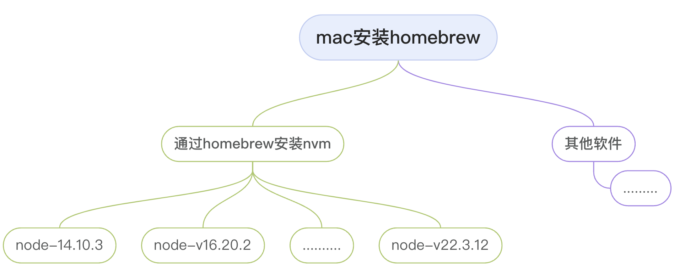
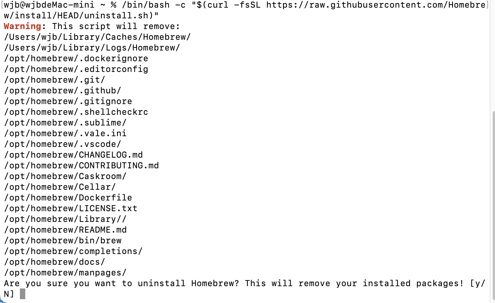

最近需要在Mac电脑上安装NVM，然后在使用NVM的过程中遇到一些问题，遂记录下来。

# 零、使用nvm来管理node



前端开发工作中，经常需要切换Node版本来适应不同项目的需求。

为了避免混乱，我们使用nvm来管理我们的node。

由于homebrew的强大。我们使用homebrew对我们的nvm进行安装。


# 一、Homebrew的安装命令解析

[Homebrew](https://brew.sh/zh-cn/) 是 Mac 上管理软件包的最实用工具之一。

我们使用官网推荐的安装方式对homebrew进行安装（这种方式需要你有VPN）：

```js
/bin/bash -c "$(curl -fsSL https://raw.githubusercontent.com/Homebrew/install/HEAD/install.sh)"
```

我们拆解一下这一行命令：

## 1.安装命令解析

### 1.1 ```/bin/bash -c```

* ```/bin/bash```：这是一个路径，指向 Bash shell 的可执行文件。Bash 是一个流行的 Unix shell，用于执行命令和脚本。这个路径确保使用的是 Bash 而不是其他类型的 shell。

* ```-c```：这是 Bash 的一个选项，表示 "command"。当 -c 选项后跟一个字符串时，Bash 会将这个字符串作为一个命令或一系列命令来执行。这意味着你可以直接在命令行上输入命令或脚本代码，而不必创建单独的脚本文件。

综上所述：这里就是相当于执行命令的```执行功能```。

### 1.2 ```$(curl -fsSL https://raw.githubusercontent.com/Homebrew/install/HEAD/install.sh)```

* ```$(...)```：这是命令替换的语法，它会执行括号内的命令，并将该命令的输出结果作为值来使用。

* ```curl -fsSL```：这部分是使用 curl 工具从指定的 URL 下载文件。-f 意味着如果请求失败则快速失败，不提示错误；-s 表示静默模式，不显示进度条等信息；-S 即使在 -s 静默模式下也显示错误；-L 表示跟随重定向。这些选项结合在一起使得 curl 可以安静地下载文件，同时确保能够处理重定向。

> 总结一下，执行这个命令可以获取安装homebrew的脚本并通过bash进行执行。

## 2.安装会遇到的异常情况

在执行这条命令的时候，你会收到一条报错，即使你有VPN。

```js
curl: (7) Failed to connect to raw.githubusercontent.com port 443: Connection refused
```

由于DNS污染，GitHub的raw.githubusercontent.com域名解析被污染了。

既然域名解析被污染了，那我们可以直接```修改/etc/host```来达到目的。

## 3.解决方案之一 - 修改/etc/host

### 3.1 获取域名对应的真实ip

可以通过[查询网](https://www.ip138.com/)等类似的可以查询到ip的网站进行查询，输入对应的域名进行查询。


下面的IP都可以，随便选一个即可。


### 3.2 HOST文件的原理与解析

#### 3.2.1 基本概念

HOST文件是一种简单的文本文件，用于将主机名映射到相应的IP地址。在计算机网络中，HOST文件的作用类似于一个静态的DNS（域名系统）服务器，允许用户手动指定特定域名或主机名对应的IP地址。

* ```映射关系```：HOST文件中的每一行都包含一个或多个IP地址和一个或多个主机名。格式通常是        ```IP address    hostname```。

```js
185.199.111.133 raw.githubusercontent.com
```

* ```优先级```：当计算机尝试解析某个域名时，会首先检查HOST文件中是否有该域名的记录。如果有，则直接使用HOST文件中指定的IP地址；如果没有，则继续使用DNS服务器进行常规的域名解析。


* ```位置```：Linux 和 macOS：通常位于 ```/etc/hosts```


#### 3.2.2 作用

1. 虚拟域名

很多时候，网站建设者需要把”软环境“搭建好，再进行上传调试。但类似于邮件服务，则需要使用域名来辅助调试，这时就可以将本地 IP 地址与一个”虚拟域名“做地址指向，就可以达到要求的效果，且无需花费。

```js
如：127.0.0.1 www.gg.com 之后在浏览器地址栏中输入对应的网站域名即可。
```

2. 加快域名解析

对于要经常访问的网站，我们可以通过在Hosts中配置域名和IP的映射关系，提高域名解析速度，当我们输入域名计算机就能很快解析出IP，而不用请求网络上的DNS服务器。

3. 屏蔽网站（域名重定向）

有很多网站不经过用户同意就将各种各样的插件安装到你的计算机中，其中有些说不定就是木马或病毒。

对于这些网站我们可以利用Hosts把该网站的域名映射到错误的IP或本地计算机的IP，这样就不用访问了。

```js
127.0.0.1  www.hao123.com
127.0.0.1  www.baidu.com
```

这样，计算机解析域名A和 B时，就解析到本机IP或错误的IP，达到了屏蔽网站A 和B的目的。

4. 方便局域网用户

在很多单位的局域网中，会有服务器提供给用户使用。但由于局域网中一般很少架设DNS服务器，访问这些服务器时，要输入难记的IP地址。

这对不少人来说相当麻烦。可以分别给这些服务器取个容易记住的名字，然后在Hosts中建立IP映射，这样以后访问的时候，只要输入这个服务器的名字就行了。

5. 顺利连接系统

对于Lotus的服务器和一些数据库服务器，在访问时如果直接输入IP地址那是不能访问的，只能输入服务器名才能访问。那么我们配置好Hosts文件，这样输入服务器名就能顺利连接了。

6. 强制域名解析指定IP

比如一些网站有很多的服务器ip，有些ip可能被和谐了，那么我们可以在hosts文件里添加我们想要的ip跟域名。

### 3.3 修改/etc/hosts文件

1. 使用文本编辑器打开/etc/hosts文件

2. 在/etc/hosts文件内部添加对应的ip和域名

```js
185.199.108.133 raw.githubusercontent.com
```

3. 保存/etc/hosts文件

4. 尝试ping raw.githubusercontent.com 如果可以ping通则表示解析成功。


> ping 用于测试网络连通性和测量网络延迟。它的名字来源于声纳术语，意为“敲击”或“询问”，用来形容发送信号并等待回应的行为。

5. 如果不生效可以尝试重启。

#### 3.4 直接尝试命令

直接执行之前的下载命令发现可以正常下载安装homebrew。


## 4. 如何卸载homebrew

1. 打开命令行，输入命令```/bin/bash -c "$(curl -fsSL https://raw.githubusercontent.com/Homebrew/install/HEAD/uninstall.sh)"```



2. 该脚本会输出删除的内容，并询问您是否要继续卸载 Homebrew。输入“y”继续卸载。注意：这也会卸载 Homebrew 软件包。
3. 等待脚本执行完成。卸载过程可能需要一些时间，具体取决于您的系统和 Homebrew 安装的数量。
4. 如果您在卸载过程中遇到任何问题，或者脚本没有正确运行，请尝试手动删除相关文件。如下，对应的文件没有删除干净，需要删除干净。

5. 将没有删除干净的文件删除干净。

6. 验证 Homebrew 是否已成功卸载。在终端中，运行以下命令：

```js
brew doctor
```

如果 Homebrew 已成功卸载，该命令将不会显示任何输出。如果仍然显示有关 Homebrew 的信息，则表明卸载未完成。在这种情况下，请尝试再次运行卸载脚本或检查您的卸载步骤是否正确。

> 注意事项：在卸载 Homebrew 之前，请确保您已卸载所有通过 Homebrew 安装的软件包。否则，这些软件包可能会在卸载 Homebrew 后出现问题。如果您不确定如何处理这些软件包，请在卸载 Homebrew 之前备份重要数据。此外，如果您在安装其他软件包管理器（如 apt-get 或 yum）时遇到问题，可能需要重新安装 macOS 或使用其他操作系统。